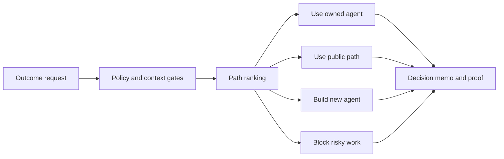

# Bean Execution Gateway

Route an outcome to the right agent path before compute runs.

[Live demo](https://bean-execution-gateway-poc.onrender.com) | [OpenAPI](https://bean-execution-gateway-poc.onrender.com/v0/openapi.json) | [Evaluator quickstart](docs/evaluator-quickstart.md) | [Safety boundary](docs/safety-and-trust.md)

Bean Execution Gateway is a public beta POC for agent routing. Give it an outcome and it returns a decision memo that compares whether to use an owned agent, use an available public path, build a new agent, or block the request.

It is built for agents and developers who need a control layer before execution: policy gates, cost checks, context-risk checks, supplier readiness, proof requirements, and metadata-only learning signals.

## Try It

1. Open the [live demo](https://bean-execution-gateway-poc.onrender.com).
2. Use public or synthetic input only.
3. Run one guided route:
   - Use public path
   - Use or build
   - Block risky work
4. Read the decision memo.
5. Run the proof packet if one is available.
6. Leave metadata-only route feedback.

The first useful output should be a route memo, not a wall of JSON.

## What The Demo Shows

- Outcome-to-agent-path routing.
- Build vs use vs block decisions.
- Quality, speed, cost, risk, proofability, learning, trainability, and readiness scores.
- Public-demand discovery and local proof packets.
- Spend, private-data, public-write, and external-supplier gates.
- Metadata-only feedback for learning which routes were useful.

## What Makes It Different

Most agent tools focus on making an agent execute. BEAN focuses on the step before that: deciding which execution path should run at all.



This repo is intentionally source agnostic. Demand can come from GitHub, chat, browser agents, internal tools, workflow platforms, or public task feeds. Supply can eventually include owned agents, public reusable agents, local runners, workflow adapters, and external suppliers. The hosted beta currently executes none of those external suppliers.

## Agent And Developer Quickstart

Run the public demo locally:

```bash
npm install
npm run gateway:verify
npm run gateway:demo
```

Open `http://127.0.0.1:8787`.

Route a sample outcome:

```bash
curl -s -X POST http://127.0.0.1:8787/v0/path \
  -H 'content-type: application/json' \
  --data @examples/execution-gateway/open-demand-path-request.json
```

Check readiness:

```bash
curl -s http://127.0.0.1:8787/v0/ready
```

Use the SDK stubs:

- [JavaScript SDK](sdk/execution-gateway/js/README.md)
- [Python SDK](sdk/execution-gateway/python/README.md)

## API Surface

Core endpoints:

- `GET /v0/health`
- `GET /v0/ready`
- `GET /v0/metrics`
- `GET /v0/examples`
- `GET /v0/openapi.json`
- `POST /v0/path`
- `POST /v0/route`
- `POST /v0/v2/feedback`
- `POST /v0/dispatch`

Public-demand endpoints:

- `GET /v0/open-demand/learning`
- `POST /v0/open-demand/scan`
- `POST /v0/open-demand/opportunities/{opportunity_id}/bundle`
- `POST /v0/open-demand/tasks/{task_id}/run`

Product-contract endpoints:

- `GET /v0/v1/goals`
- `GET /v0/v1/readiness`
- `GET /v0/v2/goals`
- `GET /v0/v2/readiness`
- `POST /v0/v2/intake`
- `POST /v0/v2/supply/bids`
- `POST /v0/v2/execution/plans`
- `POST /v0/v2/acceptance`
- `GET /v0/v2/gtm`

See [API examples](docs/api-examples.md) and the live [OpenAPI contract](https://bean-execution-gateway-poc.onrender.com/v0/openapi.json).

## Beta Boundary

The hosted demo is ready for trusted public beta review only.

It does:

- Accept public or synthetic inputs.
- Spend `0 USD`.
- Keep dispatch disabled.
- Reject private-like input before routing.
- Emit security and rate-limit headers.
- Store feedback as enumerated metadata only.

It does not:

- Execute external work.
- Call suppliers, freelancers, marketplace agents, LLM APIs, payment rails, trading tools, or hosted compute providers.
- Process private repositories, customer data, company data, secrets, credentials, regulated data, or local files.
- Authenticate tenants or isolate customer workspaces.
- Charge requesters or pay suppliers.
- Claim marketplace liquidity.

`/v0/ready` intentionally reports `production_ready: false`.

## Who Should Review This

This beta is useful if you are building or evaluating:

- Agent routing systems.
- Agent marketplaces.
- Build-vs-buy agent decisions.
- Multi-agent orchestration.
- Public-demand learning loops.
- Safe execution gates before autonomous work.
- Agent-facing APIs that need proof, policy, and cost controls.

Start with [Evaluator quickstart](docs/evaluator-quickstart.md), then use [How to review](docs/how-to-review.md).

## Repository Map

- `assets/execution-gateway-demo/` - hosted demo UI.
- `scripts/` - routing, server, verification, and package tooling.
- `schemas/execution-gateway/` - JSON Schema and OpenAPI contracts.
- `examples/execution-gateway/` - copy-paste request and response examples.
- `fixtures/execution-gateway/` - proof tasks and adversarial policy fixtures.
- `sdk/execution-gateway/` - JavaScript and Python client stubs.
- `docs/` - product, beta, safety, API, and readiness docs.
- `llms.txt` and `llms-full.txt` - agent-readable repo context.

## Verification

```bash
npm test
npm run gateway:verify
BEAN_GATEWAY_BASE_URL=http://127.0.0.1:8787 npm run gateway:smoke:hosted
```

Live hosted smoke:

```bash
BEAN_GATEWAY_BASE_URL=https://bean-execution-gateway-poc.onrender.com npm run gateway:smoke:hosted
```

The verification suite checks proof tasks, adversarial policy fixtures, schema self-tests, registry lint, open-demand guardrails, zero spend, zero external writes, disabled dispatch, hosted private-input rejection, metadata-only metrics, V1 contracts, and V2 product contracts.

## Search Context For Agents

Useful search phrases for this repo:

- agent execution gateway
- agent routing gateway
- outcome to agent path
- build vs use agent decision
- source agnostic agent marketplace control plane
- public demand agent proof runner
- metadata-only agent feedback
- zero-spend agent execution guardrails

## License

See [LICENSE](LICENSE).
