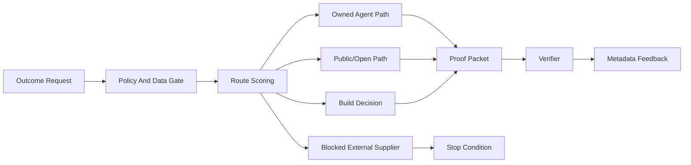

# Public Beta Onboarding

Use this document for a trusted external user who is trying BEAN for the first time.

## Start Here

Live demo: https://bean-execution-gateway-poc.onrender.com

Only use public or synthetic inputs. Do not paste private, customer, company, work, secret, credential, internal, regulated, or local-file data.

## What To Try

1. Open the live demo.
2. Read the yellow public-demo boundary.
3. Click a proof example.
4. Run an open-demand scan using `Fixture`.
5. Select a candidate.
6. Build a packet.
7. Run the verifier.
8. Notice that external submission remains gated.
9. Mark a route useful or not useful.
10. Open `/v0/v2/readiness` to see why private, paid, customer, and supplier traffic remain blocked.

## Architecture In Plain English

## Demo Tasks

- Public issue to local triage packet.
- Public benchmark to local proof packet.
- Public research task to route decision.
- Non-code public task to agent path.
- Blocked paid/public-write request.

## What Not To Do

- Do not paste private prompts.
- Do not use it for a real customer workflow.
- Do not ask it to spend money.
- Do not ask it to post publicly.
- Do not ask it to call a supplier.
- Do not treat a route as permission to execute outside the demo.

## Feedback

Use GitHub Issues for non-sensitive feedback, or use the in-demo useful/not-useful controls. Never include secrets or private context in a public issue.
